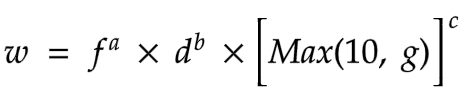
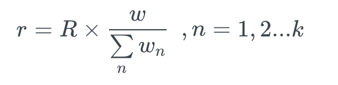
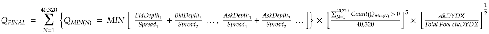

---
DIP: Dip-trading-liquidity-formula
title: Update Trading & Liquidity Provider rewards formulas.
status: Proposed
author: Andrei Sandu (@snow90a)
shortDescription: Update Trading & Liquidity Provider rewards formulas to include holding of stkDYDX.
discussions: https://commonwealth.im/dydx/proposal/discussion/2940-drc-update-trading-liquidity-provider-rewards-formulas-to-include-holding-of-stkdydx
created: 2021-12-21

---

This is the template for DIPs.

Note that an DIP number will be assigned by an editor. When opening a pull request to submit your DIP, please use an abbreviated title in the filename, `DIP-draft\_title\_abbrev.md`.

The title should be 44 characters or less.

\## Simple Summary

Update Trading & Liquidity Provider rewards formulas to include holding of stkDYDX. This will better incentivize utility of the DYDX token, usage of the dYdX ecosystem, and to protect the protocol through increased adoption of the Safety Staking Pool.

\## Abstract

**Adjust the Individual Trader Score formula within Trading Rewards to:** 

 

Where: 

*w* = Trader score

*f* = Total fees paid by a trader in this epoch.

*d* = A trader’s average open interest (measured every minute) across all markets in this epoch.

*g* = A trader’s average stkDYDX held (measured randomly every minute) throughout the epoch

*a* = 0.67

*b* = 0.28

*c* = 0.05

The remaining formula within [Trading Rewards](https://docs.dydx.community/dydx-governance/rewards/trading-rewards) will remain constant: 

 

**Adjust the Liquidity Provider Rewards formula to:** 

 

Where the existing [Liquidity Provider Rewards formula](https://docs.dydx.community/dydx-governance/rewards/liquidity-provider-rewards) is held constant except for the addition of:

*stkDYDX* = avg amount of stkDYDX held (measured randomly every minute) across the epoch

*Total Pool stkDYDX* = Total amount of all Liquidity Provider participants’ *stkDYDX score* across the epoch. 

\## Motivation

It is quite clear that the existing liquidity mining programs have been extremely successful in incentivizing onboarding and usage of the dYdX protocol since its inception. However, the liquidity mining programs do not currently incentivize users to remain participants in the dYdX ecosystem. 

By including stkDYDX as variables in the Trading Rewards and Liquidity Provider Reward formulas, the community can better convert dYdX protocol users to become long term participants in the dYdX ecosystem and, ultimately, contributors to the protocol while further protecting the protocol from existential black-swan events via increasing the size of the Safety Staking Pool. 

For the Trading Rewards update, we include *Max (10, g)* to ensure that new dYdX users have the ability to mine DYDX without needing to come to the exchange with the token. This will also ensure small holders have the ability to consistently benefit from the Trading Rewards program and become more meaningful participants in the dYdX ecosystem over time. 

The Liquidity Provider rewards program has been extremely successful in both onboarding top tier market makers onto the dYdX protocol and bolstering standing liquidity on the orderbooks. On the latter point, however, despite the dYdX protocol having, on some days, the deepest orderbooks for BTC and ETH in all of crypto, volumes have not been directly correlated. Thus, we can assume the dYdX protocol is currently over-paying for standing liquidity.

The adjustment to the formula, therefore, may slightly reduce standing liquidity and uptime in favor of incentivizing market makers to become more meaningful participants in the dYdX ecosystem. To lessen that potential impact, we include an exponent of 1/2 for the *stkDYDX* variable. 

\## Relevant Links

Community discussion thread: [<https://commonwealth.im/dydx/proposal/discussion/2940-drc-update-trading-liquidity-provider-rewards-formulas-to-include-holding-of-stkdydx>]

DRC Snapshot: [<https://forums.dydx.community/snapshot/dydxgov.eth/0xfbcb8104dc469cae09727dea89577f89b37df784c3ef2715b26ab77e9ae15161>]

Safety Module Smart Contract:[<https://etherscan.io/address/0x65f7BA4Ec257AF7c55fd5854E5f6356bBd0fb8EC>

Safety Module Documentation: [<https://docs.dydx.community/dydx-governance/staking-pools/safety-staking-pool>]

Safety Module Blogpost: [<https://dydx.foundation/blog/en/safety-staking>]

\## Implementation

DYDX smart contracts do not directly control the liquidity mining formulas. As such, once DYDX holders provide feedback on this DRC, a DRC Snapshot will be created. If approved, the dYdX Foundation will request that dYdX Trading Inc. implement the changes in time for Epoch 5.

\## Copyright

Copyright and related rights waived via [CC0](https://creativecommons.org/publicdomain/zero/1.0/).
